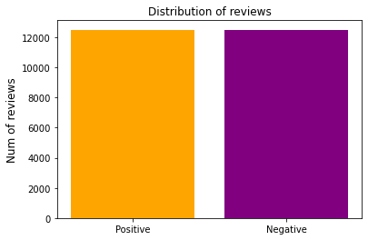
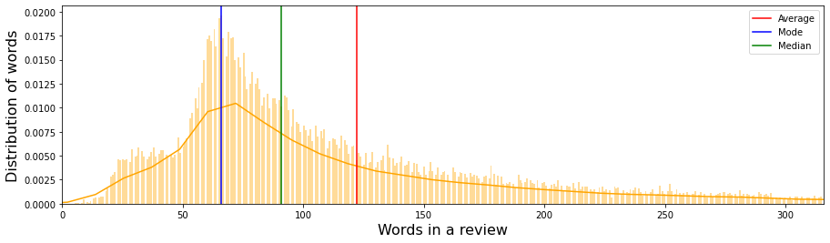
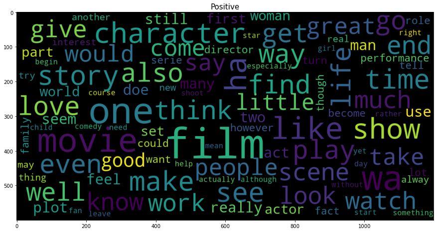
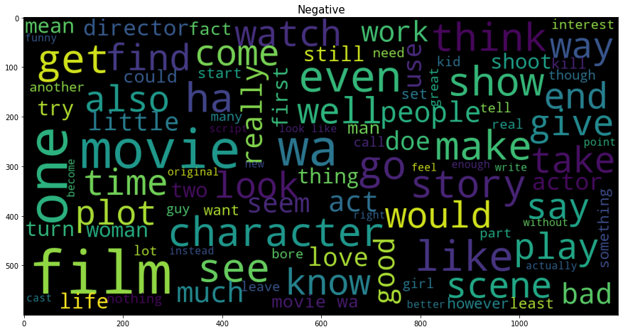

# IMDB-Reviews-Sentiment-Anaylsis
Training a model to predict positive/negative sentiments from a movie's review on IMDB

## Bag of Words Implementation 

I first began by training a baseline model using the Bag of Words (BoG) algorithm, using guidance from the instructions provided <a href="https://www.kaggle.com/c/word2vec-nlp-tutorial/overview">here</a>.

To evaluate my model, I used the Keggle's submission option that allocated a score based on the area under my model's ROC curve. Using the BoG implementation, I was able to obtain my default scores (listed below). For my classifier, I utilized Scikit-Learn's Random Forest Classifier, first with a default of ```n_estimators = 100 ``` and later (at the cost of greater time required to train the model) with ```n_estimators = 400```. While I noticed an increase in my score, it was quite minute compared to the increase in time.

| Implementation | Score |
| -------------- | ------ |
| BoG, 100 trees | 0.8432 |
| BoG, 400 trees | 0.8590 |
| BoG, 1000 trees| 0.8558 |

As we can clearly observe, increasing the number of trees in my RF classifier worked to a certain extent, yet after a cut-off point, it stopped increasing my score and was actually detrimental. 

## Word2Vec Average Vector Implementation

After establishing a baseline using the BoG model, I moved on to using the Word2Vec Neural Network algorithm established by Google, with documentation found <a href="https://radimrehurek.com/gensim/models/word2vec.html">here</a> and using guidance in implementing it from <a href="https://www.kaggle.com/c/word2vec-nlp-tutorial/overview">here</a>. 

I finetuned my hyper-parameters, as per the recommendations established in this research paper by Stanford found <a href="https://cs224d.stanford.edu/reports/SadeghianAmir.pdf">here</a>. Moreover, to train the model, I used the 75,000 reviews (25,000 labeled and 50,000 unlabeled) provided by Kaggle. 

However, the results of the implementation itself were disappointing since I failed to notice an improvement in score, rather suffering a slight decrease from my BoG implementation 

| Implementation | Score |
| -------------- | ------ |
| BoG, max score | 0.8590 |
| W2V, Avg Vec | 0.8314 |

## CNN Implementation

Having observed a minimal change in the score from using the Word2Vec algorithm, I realized that I had two options available for me to pursue to further increase my accuracy. 

Firstly, considering the nature of my data (reviews in the form of paragraphs), I could consider using the Doc2Vec algorithm which would not only perform the function of Word2Vec and create feature vectors for my words, but also consider the exact order the words appear in a paragraph, hence creating a feature vector for each paragraph as well. Following the methodology described in this <a href="https://cs224d.stanford.edu/reports/SadeghianAmir.pdf">research paper</a>, I was able to increase my score quite substantially (results shown below).  

However, I came to the conclusion that to obtain the best possible results, I would need to build my own custom Convolutional Neural Network (CNN) that allowed me to conduct the sentiment analysis. However, after training my CNN on the provided 25,000 labeled images, I realized that this data was insufficient to accurately minimize my loss function and increase my accuracy with each epoch trained (I stopped noticing a decrease in the loss value after ```epoch=3```). 

As a result, following the guidance from <a href="https://www.kaggle.com/nilanml/imdb-review-deep-model-94-89-accuracy">here</a> and <a href="https://www.kaggle.com/alexcherniuk/imdb-review-word2vec-bilstm-99-acc">here</a>, I augmented my training dataset by including 50,000 more reviews provided by <a href="https://www.kaggle.com/utathya/imdb-review-dataset">Kaggle</a>. After training my CNN model on such a dataset, I was able to experience a substantial improvement in the result (even with very few epochs, as shown below). 


| Implementation | Score |
| -------------- | ------ |
| Paragraph2Vec | 0.9082 |
| CNN, Epoch=3 | 0.9407 |
| CNN, Epoch=8 | 0.9771 |
| CNN, Epoch=32 | 0.9843 |

## Sentiment Analysis

(All analysis performed from this point onwards is conducted on the CNN model trained with ```epoch=8``` - after observing the accuracy and loss curves of the ```epoch=32``` model, I found this to be the best trade-off between minimizing loss, maximizing our score, and training our model in a short period of time on a personal computer)

While a similar analysis has been conducted in the Jupyter Notebook itself, I have duplicated the results here (with better explanations and greater verbosity) for ease of access. 

### Distribution of Data

First, we will ensure that our distribution for the training data is equally balanced between positive and negative reviews. This is to ensure that our model is trained on a distribution most similar to the real-world testing data. 



As we can clearly see here, our model is as we want it to be: perfectly balanced (as all things should be!) between positive and negative reviews. 

### Distribution of Word Length

Now, we can draw a graph that lets us observe how our training data's word length is distributed for each review. By doing so, we can analyse the average number of words in each review, alongside the mode and the median. 



As we can clearly observe in the above graph, the distribution of our word lengths for the reviews in the training data is not perfectly normal but rather left-skewed. We also obtain the following statistics:

| Statistic | Value |
| --------- | ------ |
| Average | 122.2 |
| Mode | 66 |
| Median | 91.0 |

### Wordclouds

To get a better sense of the words used in the reviews themselves, I drew wordclouds, using guidance from <a href="https://www.kaggle.com/sameerdev7/93-f-score-bag-of-words-m-bags-of-popcorn-with-rf">here</a>. Let us observe the word clouds we get from the cleaned up positive and negative reviews in our training data. 





This provides us some very interesting information. First of all, we can observe that some words are quite common in both. For example, words such as 'film', 'movie', 'character', etc. are some of the most repeated words in both kinds of review. This makes intuitive sense since regardless of the sentiment associated with our review, we would expect them to use such neutral words quite frequently. 

However, we do notice differences in the wordclouds after analysing a bit deeply. In the positive wordcloud, we see words such as 'good', 'great', 'love', etc. which highlight the positive sentiment associated with our review. In comparison, such words are not at all seen in the negative wordcloud, where words such as 'bad' and 'bore' are frequently used. This too matches with our analysis and presents how sentiment is associated with words in the movie reviews.


